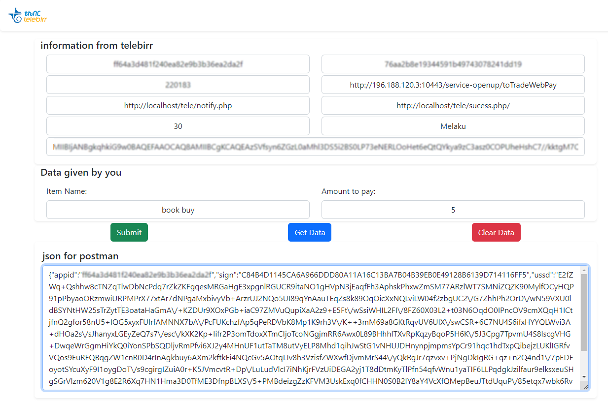
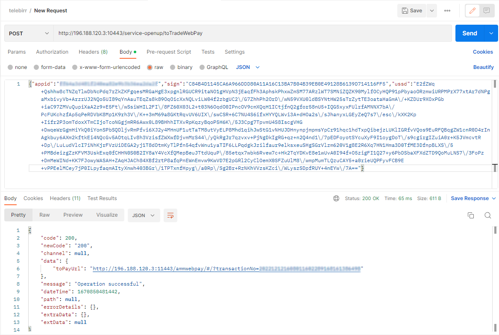
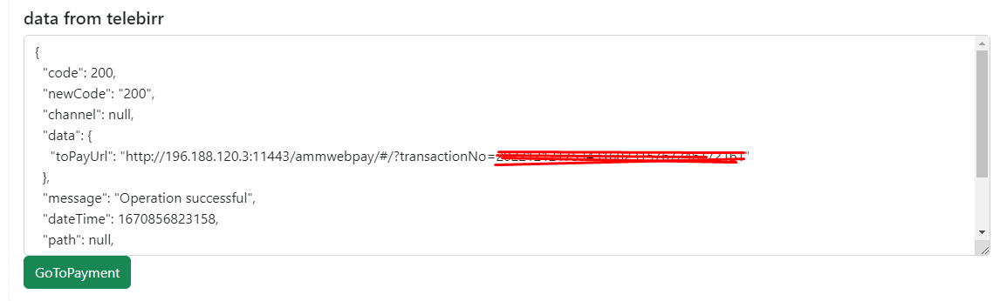

<a href="https://aimeos.org/">
    
</a>

# telebirr


this repo will help you get the request data by inputting all your provided informations


## Installation
```
git clone https://github.com/MelakuDemeke/telebirr.git
```
## Usage
### Required information's
you will receive the required information from Tele with information which looks like theis :arrow_down:

| merchant name   | short code   |  APP ID | APP KEY  |  Public ID | H5  | InApp Payment   |
|---|---|---|---|---|---|---|
| owner name  | 6-digit code  | 32-character Id  | 32-character key  | 392-character public key  | web payment url  | mobile payment url  |

after getting those informations fill it on the input section according to the label

1. fill out all the informations
2. click on get `get data for postman` it will give you a json data with 3 key value pairs
3. use the json in postman

- you can also open the payment screen by clicking `goToPayment`
